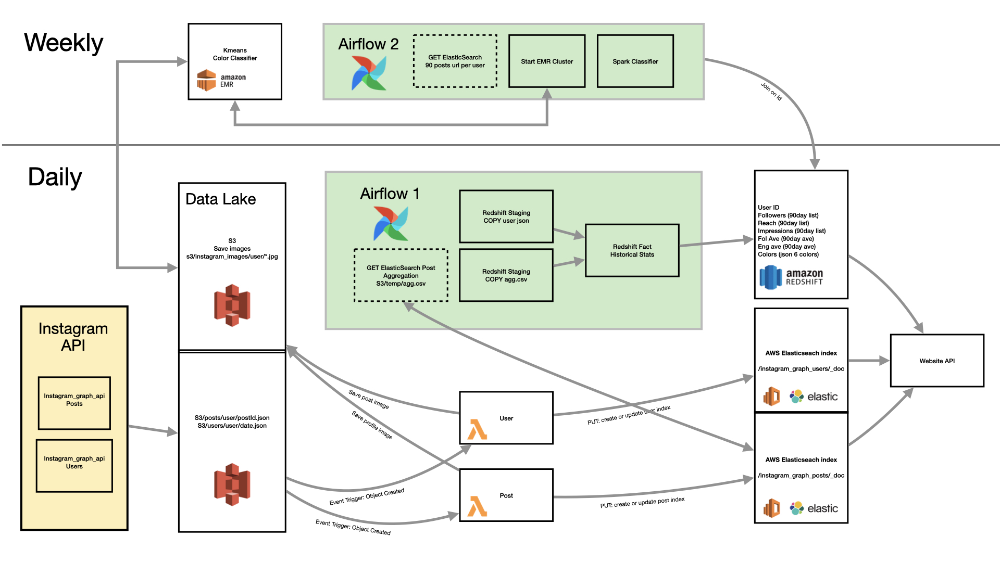
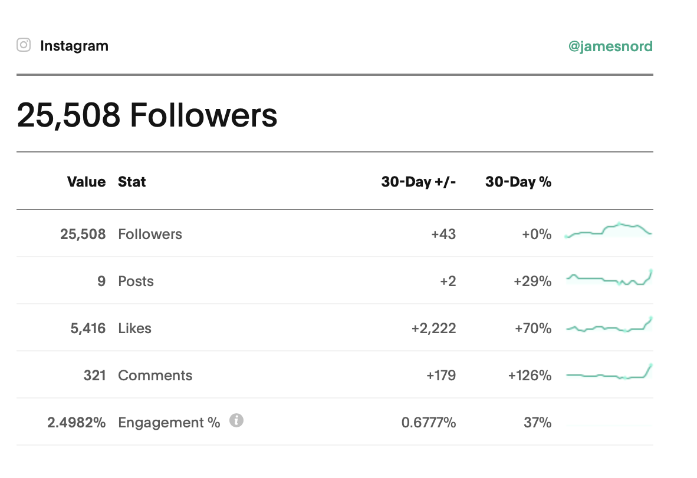
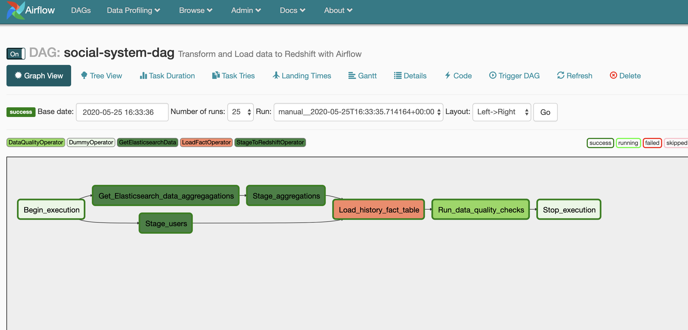
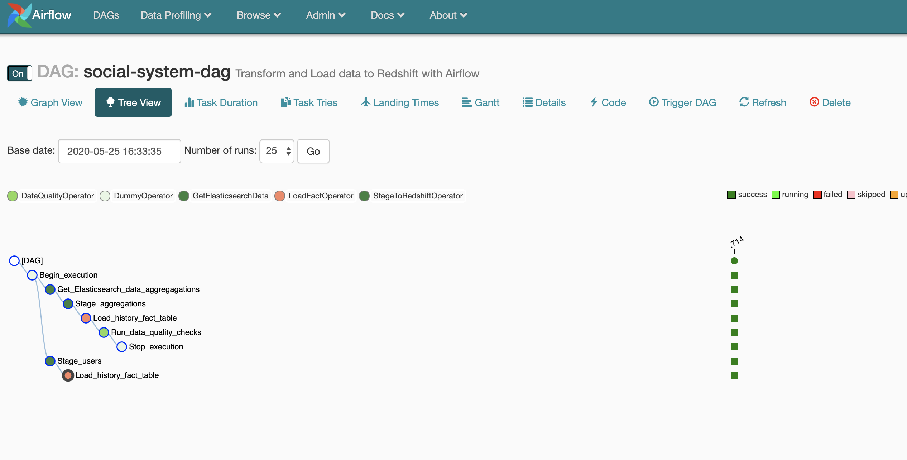
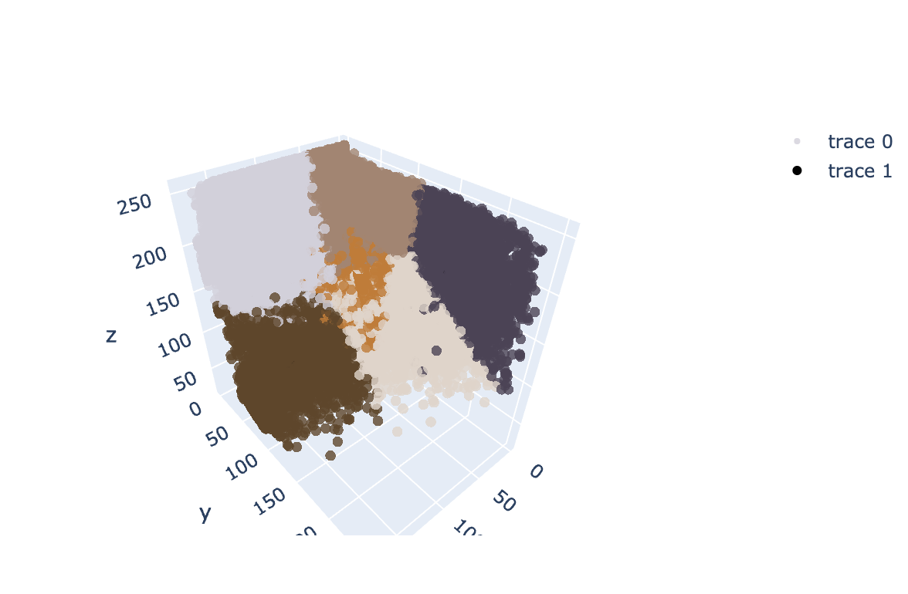
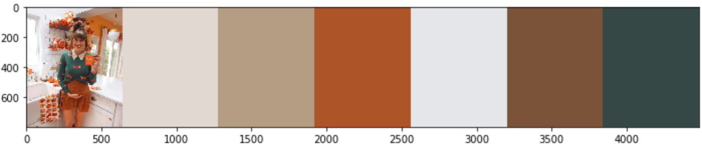
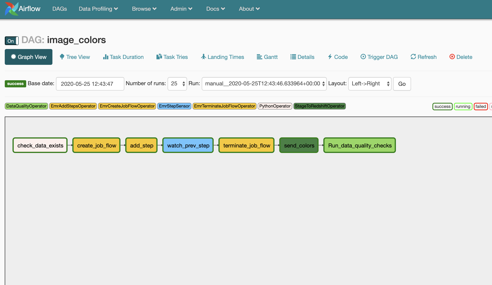
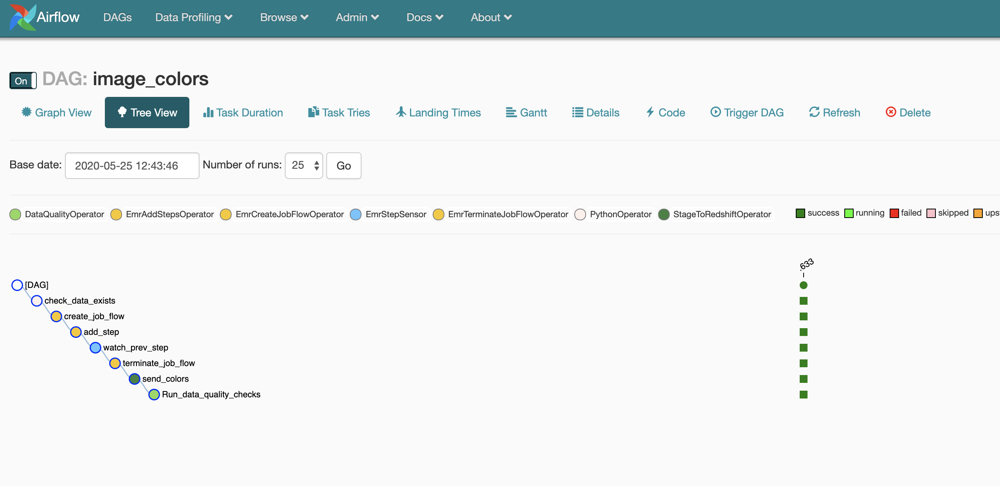
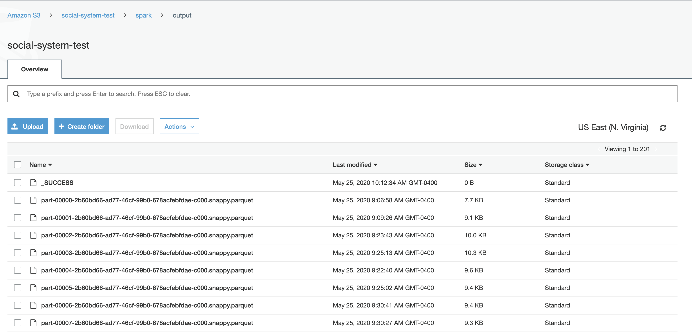
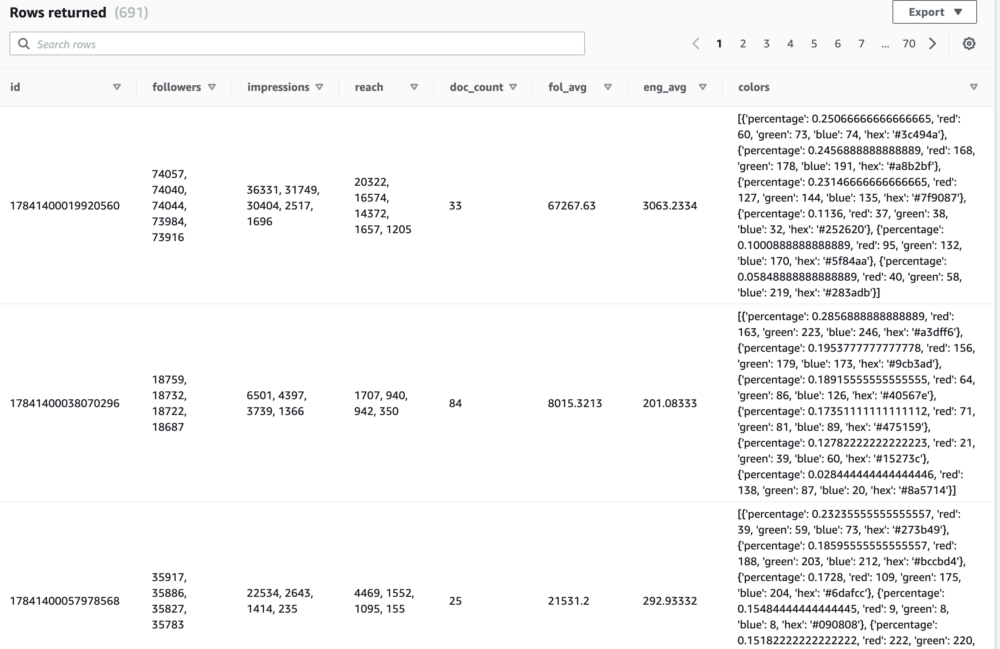

# Data Pipeline Capstone Project
### Udacity Data Engineering NanoDegree
---

## Project Scope 

Build AWS Data Lake and Data Pipeline to Elasticsearch and Redshift with Apache Airflow and Spark

The goal of this project to create a data pipeline and data model for a social media ambassador agency. The agency connects prominent Instagram users to brands looking for ambassadors and product promotions. Brands looking for a user to work with will need to see aggregated data on each user about their social media following as well as the type of content the user typically creates. This data is the foundation of the agency's subscription-only brand facing website. Brands will use the site to search users and view their content.

Social Media users who sign up to be featured on the platform authorize the agency to collect data from two instagram endpoints, User Insights data and Media Insights data (further referred to as post data). User data must be updated regularly to keep up with changing user profiles. Total follower counts, profile images and locations are important to brands looking for a Instagram ambassador. Data on individual posts are collected in order for brands to search for users who might typcially speak about their particular subject matter (cooking, travel, makeup, etc) and find that users average follower engagement to compare with others. Data on individual posts grows quickly and it also changes drastically in the first days after creation ("likes" count grows drastically in the first few days). It too must be created and updated regulary. 

Finally, to set this agency apart, we will augment the data with two custom machine learning algorithms to better classify each user.  The first is a 
Instagram specific image classification in Tensorflow. This model makes a prediction about the image content in one of 33 categories specific to social media. Finally, certain fashion brand marketers are often looking for specific color palettes when partnering with a content creator. We will augment the data with a K-means algorithm to determine 6 cluster centers of all recent photos combined to create an user color pallete over all of their images. These image augmentations will be used in a future recommender system to help brands find even more users. 

The agency is growing rapidally and will need a robust way to handle more data.  The current userbase creates about 20 million posts per year and the agency is hoping to grow that to 100 million posts per year very soon. 

--- 
## Data Exploration 

The company has built an API client which will store a single json file for each post labeled with the post id under a folder for each user id. The api client runs once daily and is given a response from Instagram on the last 25 posts from each account. For any posts new to the datalake, a new json file will be created. The remaining responses from the API call will *update* previous files. Additionally, the API Client will return and store data from a 'users' endpoint with data particular to each account.  
 
### 5 Media Types x 2 Connection Types

To add some complexity to this data, the company has two different relationships with it's users. Typical users on the platform are connected via a "Basic" api. This authoriztion allows for the company to see *some* data on the account relavent to the performance such as the count of likes and comments. However, Users who are working through the company on a specific paid campaign with a brand are allowed to connect their "Business" api. This endpoint returns more data such as "reach" and "impressions".

### Volume

Currently the company would like to process 50,000 users on the platform each producing ~0.5 posts per day. However, an expandable solution is needed with an option to increase it's user base to 500K or more. 

Thus, each day the pipeline should consume 25k JSON and image files with a potential growth to 250k. 

### A Repeat Process 

The nature of data is that it will be *updated*. This is an important consideration in the pipeline. A json with the specifics of the post be created within the first day of it being published to Instagram. However the API client must go back and reload the data again and again to update the post metrics with recent likes, comments, reach and impressions happening. 

Currently, the Instagram API returns the latest data on the most recent 25 posts for a user. The company's client will call each user's API reponse update the recent 25 posts each day.

The 25th oldest post may have been last week for a prolific user or 6 months ago for a infrequent user. Each post may have slightly updated data and will need to be loaded.

Our pipeline will need to handle more volume than the data suggests as the ETL process will likely be repeated many many times on JSON files of the same name. Thus, to save costs, the pipeline will need to be creatitive and efficient in how it finds only the updated posts. 

**Posts** 

There are five *types* of Instagram post and each type will create a json file with slightly different values. 

- `IMAGE` - These are in-feed image posts with a single photo
    - JSON will include "likes" and "comments"
- `CAROUSEL ALBUM` - These are indentical to IMAGE type but contain multiple photos
    - JSON will include a "children" key with a dictionary value leading to a list of image urls and ids
- `VIDEO` - These are similar to in-feed IMAGE type but with a video instead of an image
    - JSON will include a "views" key in addition to the media is stored as an .mp4 file
- `STORY IMAGE` - These are temprorary posts that do not allow for likes and comments
    - JSON will not incluede keys for "likes" or "comments", but will include new metrics "sticker_taps", "tap_backs", "swipe_ups"
- `STORY VIDEO` - Similar to STORY IMAGE but media is a video.
    - JSON does not include a "media" key or a url to an mp4 file, but rather a "Thumbnail" key pointing to a url with a .jpg file stored. 

**Source 1 - post data**

Sample `CAROUSEL ALBUM` post: 
```
{
"caption":"This is the caption of the post",
"comments_count":199,
"id":"1784999999",
"ig_id":"2248137977777777",
"is_comment_enabled":true,
"like_count":888,
"media_type":"CAROUSEL_ALBUM",
"media_url":"https://scontent-iad3-1.xx.fbcdn.net/v/t51.xxxxxx",
"owner":{"id":"178414000888888",
         "username":"kariah.von",
         "followers_count":5993},
"permalink":"https://www.instagram.com/p/B8y_ZttbnlwiT/",
"shortcode":"Bfdjkaf;slwiT",
"timestamp":"2021-02-20T17:05:52+0000",
"username":"igUser",
"children":{"data":
            [
                {"id":"178823899999999",
                "media_type":"IMAGE",
                "media_url":"https://scontent-iad3-1.xx.fbcdn.net/v/t51.xxxxxx"
                 },
                {"id":"178823899999998",
                "media_type":"IMAGE",
                "media_url":"https://scontent-iad3-1.xx.fbcdn.net/v/t51.xxxxxx"
                },
                {"id":"178823899999997",
                "media_type":"IMAGE",
                "media_url":"https://scontent-iad3-1.xx.fbcdn.net/v/t51.xxxxxx"},
            ]
           },
"mentioned_users":"udacity, nanodegree",
"hashtags":"learningData"
}
```

**Soure 2 - user data**

Sample basic user data:

```
{"created_at":"2020-05-09",
"biography":"Person on Instagram who writes a bio",
"id":"17841400036094485",
"ig_id":287041203,
"followers_count":5333,
"follows_count":18,
"media_count":93,
"name":"Printed Name",
"profile_picture_url":"https://scontent-iad3-1.xx.fbcdn.net/v/xxxx",
"username":"udacity"}
```

Sample business user data:

```
{"created_at":"2020-05-20",
"biography":"📍online \n💕",
"id":"1784122222222222",
"ig_id":123456789,
"followers_count":37226,
"follows_count":2610,
"media_count":2093,
"name":"Data Learner",
"profile_picture_url":"https://scontent-iad3-1.xx.fbcdn.net/v/xxx",
"username":"udacity",
"website":"https://bit.ly/3bIJCO3",
"impressions":3759,
"reach":1301,
"follower_count":3,
"email_contacts":0,
"phone_call_clicks":0,
"text_message_clicks":0,
"get_directions_clicks":0,
"website_clicks":1,
"profile_views":31}
```


**Initial Data Considerations**

Compared to many projects, this data is very clean and tidy. The API is stable and produces constrained data. However, with so many sources and types, it can be tricky to make it all fit into the same model in the same manner. 

There are some keys in post and user json files with nested data which will need to be flattened. 

Follower count is listed in users, but *not always* in posts. Posts from Business Connections will return follower counts on a given post near the time of posting. For some purposes the pipeline will need to bring these sources together.

Post and User data from the Basic connection will be missing Reach, Impressions and other metrics. The company is aware of this and expects data to be null from these users

--- 
## Data Model

The company website would like to allow brands to search posts for keywords, mentions, and hashtags. It will also present those results with the corresponding media object. Only posts going back 180 days will be needed for search.  

Additionally, each IG user will be represented with a single profile page showing historical stats and recent posts. 

The website requires a transactional search endpoint for the website to use as well as a pre-aggregated Fact table to populate each user page. 

The company has spent considerable time on configuring search results with Elasticsearch and would like to continue to use this tool. Elasticsearch allows the flexibilty of an adjustable schema given that our data responses from the Instagram API differ. Elasticsearch is a distributed system which allows for replicas. 

**Proposed Pipeline**



The pipeline design will begin with a data lake in an AWS S3 bucket and will transform the data to a transactional state for the website to call quickly. As the company grows this data lake will support higher volume data ingestion and leave flexibility for future analytics. All data features from the Instagram API can be stored in S3 even if they may not be relevent now. Users and posts will be stored separately. File names will connect to their account id, post id or date.  This will allow for easy schema reads from services such as AWS Glue in future use cases. 

**Data Lake Heirarchy**

```
-instagram_graph
    --posts
        --user_id
            --postid_1.json
            --postid_2.json
    --stats
        --user_id
            --date_1.json
            --date_2.json
```


**Endpoint**

Only 6 months worth of data will need to be stored in the more expensive transactional data store, Elasticsearch. Therefore, this model will transform current data and where possible use only this time window from the data lake. This will reduce costs for the company and speed queries on the smaller database. 

### **AWS Lambda** - 

The data lake will quickly grow to a volume which requires a lot of hardware to perform a traditional ETL. Given that we only need 6 months of data to transform and that data must be updated daily, rather than extract all data in our data lake only to filter out the last 6 months, this model will use Lambda Functions to process only the newest data to the transactional data model. 

AWS Lambda functions run on serverless architechture and can be run asyncronously at a large volume. Each data transformation runs in ~2 seconds and the company has access to 1,000 Lambda functions concurrently. While not the cheapest option, this could allow for nearly 40 million new posts to be ingested in a day, far more than the company will see in near future. 

This model includes two separate lambda functions. Each triggered to run anytime an object is created or updated in the appropriate folder.

**S3-posts-to-ES**

This function - 

- reads in the updated json
- flattens the nested json
- checks to see if the media items have alrady been stored in s3
  - if not, parses the name of the media item and stores it in S3 to be later processed
- connects to AWS Elasticsearch
- creates or updates the Elasticsearch document associated with the post id

**S3-users-to-ES**

This function - 

- reads in the updated json
- removes values uneeded in the transactional DB
- checks to see if the media items have alrady been stored
  - if not, parses the name of the media item and stores it in S3 to be later processed
- connects to AWS Elasticsearch
- creates or updates the Elasticsearch document associated with the post_id and date


AWS triggered action on each PUT request. Primarily becuase each data point will be *updated* by the api client. Data is not static. Using another tool such as airflow did not have an ability to easily extract newly updated objects from the Data Lake. 

### **Airflow Daily**

Each day the pipeline uses airflow to update the transactional data store for user profiles. This will help brands determine if the IG user is on a growth trajectory.

While Elasticsearch will be used to populate some data with most recent user stats, a portion of the page will need to present a profile history from data aggregated from sources other than the Elasticsearch DB.



The website requires the following information:

| Data	| Type |  Sample  |
|---	|---	|---  |
|id 	| varchar |  '12345687654321'   |
|followers|list - integers| [3444, 3566, 3570, 3450...]    |
|impressions |list - integers|  [15897, 14786, 12987, 14555...]   |
|reach |list - integers |  [12897, 11786, 9987, 11555...]   |
|doc_count | int |  14   |
|fol_avg| float	|  3567.2   |
|eng_avg*| float	|  255.2  |

*This represents the average daily interactions (likes plus comments) on posts. Which is easily converted to the rate of engagement with the follower counts included.

**social_system_dag**

This dag: 

- Copies the daily stats json files from the data lake
- Stages the user stats to Redshift
- Connects to AWS Elasticsearch
- Stages an aggregation of post attributes from the last 30 days
- loads the fact table with a combination of the sources




### **Airflow Weekly**

Each week this model will add additional data augmentation to each profile. It will analyze the most recent images and determine a dominent color palette of the images in each user's social media feed. This will help brands to quickly see the tone and feel of the content the user creates.  

**Image Color Classification**

Sample of color classification on a single image. 




This step will prepare a list of json-like objects that the company site can parse and build into a display.

The color data will be joined to the AWS Redshit Fact table with each users profile aggregations for a single DB call for each page build.

Needed in the response:

| Data	| Type | Explanation |
|---	|---	|--- |
|volume of color  | float | The percentage of all pixels which belong to this cluster|
| - red composition | int | x coordinate of cluster center |
| - blue composition | int | y coordinate of cluster center|
| - green composition | int |z coordinate of cluster center |
| - hex value | string | another method to present color on the site|

```
[
      {
        "percentage": 0.3292,
        "red": 221,
        "green": 194,
        "blue": 178,
        "hex": "#ddc2b2"
      },
      {
        "percentage": 0.2223,
        "red": 168,
        "green": 140,
        "blue": 113,
        "hex": "#a88c71"
      },
      {
        "percentage": 0.12,
        "red": 45,
        "green": 48,
        "blue": 41,
        "hex": "#2d3029"
      },
      {
        "percentage": 0.1188,
        "red": 143,
        "green": 96,
        "blue": 56,
        "hex": "#8f6038"
      },
      {
        "percentage": 0.1173,
        "red": 75,
        "green": 80,
        "blue": 46,
        "hex": "#4b502e"
      },
      {
        "percentage": 0.0924,
        "red": 182,
        "green": 178,
        "blue": 193,
        "hex": "#b6b2c1"
      }
    ]
```

To perform such a large job, this airflow dag will create an AWS Emr cluster to read all the images previously saved in the lambda step and use a distributed cluster to classify each user's images. The classification uses a Kmeans algorithm to determine 6 pixel centers across all images. It uses only rgb images. While it may be more mathmatically sound to first determine the optimal number of clusters given the image data, the designers of website prefer to use a static representation. 6 was determined to the be most common number of clusters producing the best Calinsky Harabaz score.

**image_w_spark dag**

This function - 
- Checks for data in the image store on s3
- Creates an EMR jobflow with the specifications listed
- Adds a step, or spark operation to be performed, to the cluster
    - image_w_spark.py
        - Loads all images from S3 store
        - Converts byte array to rgb 3d vector
        - Concatanates all image vectors
        - returns Kmeans cluster centers for each user*
        - Writes the results to S3 as parquet files
- Waits for the step to be completed
- terminates the cluster
- Copies Parquet files into a Redshift Staging table


*While Spakrk ML has a very convenient distributed Kmeans algorithm, the requirements of this task did not require Kmeans classification on a single data set too large for one machine. Instead, a Kmeans classification was needed on thousands of moderately sized data. Thus the normal Sklearn Kmeans worked well, but uses Spark's distributed nature to be performed asyncronously with a pandas UDF. 




S3 Output to Parquet files. 200 files brokend by the default partition settings in Spark. 



--- 
## DATA Dictionary 

Listed below are augmented search results as a guide to working with the resulting databases. 


**Elasticsearch Post Index**

Query:
```
GET /instagram_graph_posts/_doc/<post ID>?pretty
```
Response:
```
{
  "_index" : "instagram_graph_posts", <- ES index where post data is stored>
  "_type" : "_doc",
  "_id" : "9991", <- ES document id & post id of Instagram>
  "_version" : 1,<- Has this record been updated>
  "_seq_no" : 1,
  "_primary_term" : 1,
  "found" : true,
  "_source" : {
    "objectKey" : "instagram_graph/posts/1/testPost1.json", <- s3 Key>
    "createdDate" : "2020-04-17 14:48:11+00:00", 
    "content_type" : "application/json",
    "content_length" : "3563",
    "content" : {
      "caption" : """shoes" #ReadingisRAD""",
      "comments_count" : 12, <- Number of comments made on this post>
      "id" : 9991, <- Instagram post id>
      "like_count" : 166, <- Number of likes on this post>
      "media_type" : "CAROUSEL_ALBUM", <- Type of post>
      "media_url" : "https://social-system-test.s3.amazonaws.com/instagram_graph_image_store/1/9991/original.jpg", <- Url where PRIMARY post image can be found>
      "permalink" : "https://www.instagram.com/p/fdjksafjdlsa/", <- Original link to Instagram post>
      "shortcode" : "fdjksafjdlsa", <- unique code slug from instagram>
      "timestamp" : "2020-03-09T12:15:52+0000", <- Date when post was created>
      "children" : {   <- Start of Carousel images>
        "data" : [
          {
            "media_url" : "https://scontent.xx.fbcdn.net/v/t51.2885-15/8927xxxxx,
            "media_type" : "IMAGE",
            "id" : "17842767428052942"
          }
        ]
      },
      "comments" : {  <- Number of comments made on Carousel image>
        "data" : [
          {
            "like_count" : 0,  <- like count on carousel image>
            "id" : "17849450488976373" <- unique id of carousel image>
          },
        ]
      },
      "impressions" : 2531, <- Number in non-unique views of the post [Business Only]>
      "reach" : 2009,  <- Number of UNIQUE views of the post [Business Only]>
      "engagement" : 130, <- Number of users who took an action on the post>
      "saved" : 27, <- Number of users who saved this post>
      "video_view" : 0, <- Video views if the image type were VIDEO>
      "owner_id" : "1", <- Id of the user who posted>
      "followers" : -1 <- Number of followers at the time of data ingestion : -1 = This Connection type not no receive data>
    }
  }
}
```
**Elasticsearch Post Index**

Query:
```
GET /instagram_graph_users/_doc/<User ID>?pretty
```
Response:
```
{
  "_index" : "instagram_graph_users", <- ES index where user data is stored>
  "_type" : "_doc",
  "_id" : "1", <- ES document id>
  "_version" : 3, <- index of updates>
  "_seq_no" : 3,
  "_primary_term" : 1,
  "found" : true,
  "_source" : {
    "objectKey" : "instagram_graph/stats/1/2020-04-15.json", <- s3 key>
    "createdDate" : "2020-04-17 14:49:11+00:00", <- date of last updated>
    "content_type" : "application/json",
    "content_length" : "709",
    "content" : {
      "created_at" : "2020-04-15", <- IG Published date>
      "biography" : "bio about the user", <- IG bio>
      "id" : "1", <- IG id>
      "followers_count" : 20598, <- Total followers on created date>
      "follows_count" : 1081,  <- Number of accounts the user follows on created date>
      "media_count" : 891, <- Total pieces of media on IG account>
      "name" : "Public facing name",
      "profile_picture_url" : "https://social-system-test.s3.amazonaws.com/instagram_graph_image_store/1/profile.jpg", <- Profile image URL>
      "username" : "udacity",
      "website" : "www.udacity.com",
      "impressions" : 422, <- total impressions across all media pieces that day>
      "reach" : 315, <- total reach across all media pieces that day>
      "follower_count" : 1 <- total number of new followers that day>
    }
  }
}
```


**Redshift Fact Table**

Query:
```
SELECT  id,
        followers,
        impressions,
        reach,
        doc_count,
        fol_avg,
        eng_avg,
        colors
FROM history;
```

Response: 
| Data	| Type |  Sample  |
|---	|---	|---  |
|id 	| varchar |  '12345687654321'   |
|followers|list - integers| [3444, 3566, 3570, 3450...]    |
|impressions |list - integers|  [15897, 14786, 12987, 14555...]   |
|reach |list - integers |  [12897, 11786, 9987, 11555...]   |
|doc_count | int |  14   |
|fol_avg| float	|  3567.2   |
|eng_avg| float	|  255.2  |
| color | String | Sting object representing color palette of user|




--- 
## Current Pipeline Performance 

| 7241 test accounts | resources | time |
|--- |--- |---|
| Lambda Post Update       | 3-5K concurrent    | ~1558ms per post |
| Lambda User Update       | 300 concurrent    | ~877ms per user |
| CWeekly Airflow Color Classification Spark  | 10 M5.Xlarge | 1 hours 30 mins |
| Daily Airflow Fact Table load | macbook & AWS Redshift COPY | 17 mins |


## Future Considerations

As the volume of data increases, some simple adjustments can be made and balanced with a consideration of cost. 

Should the data increase 10x (expected in two years):

- Color Classification - Initial data growth can here can handled with more machines on the cluster. Should the cost of this begin to outweigh the value of the data, a decision could be made to run this operation less frequently.

- Lambda Functions - Initial data growth can be handled by raising the aws limit of concurrent executions. When the cost of this becomes prohibitive, the job can be moved to a Spark cluster. However, in order to create efficiency in the process, the current API client storing the Json files should be refactored to store only updated files in a staging folder. After the subsequent Spark task is finished transforming the data and loading it into the search store, it could move the json file from the staging area to the user's folder. 

- Elasticsearch - 180 days worth of elasticsearch store could become expensive for the business. If the data increased 10 fold, a decision could be made to reduce the term of data available in the search. 

Should the data increase 100x:

- The first concern will be the volume of data in the "post" index of Elasticsearch. This scenario would be collecting 2.5 million posts per day, and 6 months of posts could be over 400 million. While this type of database can be sharded and distributed, the cost of adding more nodes and the potential latency of the response could force the current 6 month policy to change to a shorter time window.

- Further concern will be the ingestion of the data. AWS lambda functions could handle the volume, however the cost could be a concern given the average run time of nearly 2 seconds, with some invocations running nearly 4-5 seconds if the post contains many images. Given the nature of the data, our "user" and "history" tables will not grow exponentially like the "post" table. Writing data to redshift, even at 100x the current state will not pose an issue. However, writing the post index in elasticsearch will need to be considered. Given that the database is distributed and eventually consistent, the load balancer and additional nodes should easily allow for writes to be spread across the cluster.

- Color Classification (and soon Tensorflow) on images will also need to be adjusted at this volume. Most likely, only a portion of the accounts will be updated each week. This allows for new users to have their images processed within a week, but does not require the entire database to be updated every week.

- Data Lake storage should be optimized in this scenario as well. AWS S3 has a very simple configuration to handle archiving of data. Quite simply we will set an expiration date on each folder. Each file older than the expiration will be automatically converted to S3's Glacier storage, a far cheaper storage option with more expensive reads. Additionally, in future analytics, AWS Glue and Athena services will ignore these files when reading. 

The major components of this pipeline run daily, but if someone wished to set a specific time, the Airflow dag schedule could be changed from "@daily" to "0 7 * * *".  

If this dag or other processes were to fail the company is in a fortunate position that subsequent runs are better than a backup, as they contain updates to the posts. Unless our pipeline fails 25 days in a row, we would not likely loose data. However, to catch these errors we can set notfications in Airflow to email on failures or tasks running too long. Additionally, AWS lambda can notify of any significant errors on the lamda executions. Instagram's user insight api can return daily follows and reach counts in a single response, if many days are missing, a new API can be written that returns more than one day to allow for the company to rebuild the historical timeline on the users profile page. 

Should the business require this dataset to also supply data to a dashboard, the first logical addition would be to aggregate our users into a single daily metric.  Number of posts, followers, and median engagement across the platform would create a useful dashboard for business intelligence. 


Currently this data model is accessed by the website thousands of times per day. If the site increases traffic, some adjustments can be made to insure availabilty and low latency. 

- Increase the number of nodes in the Elasticsearch cluster and create replicas in additional AWS availabity zones

- Increase the number of nodes in the Redshift cluster and create replicas in additional AWS availabity zones


--- 

## Next Steps

This Udacity project will be the foundation of a more robust data pipeline. 

**Add NLP and Tensorflow**

The company has built a recommendation system that blends a Natural Language Processing vector built from a users captions with a Tensorflow image classification model built to classify social media image types. This pipeline will be enhanced further to return user vectors for each on a weekly basis. 

**Refactor Color Kmeans** 

Currently this process is viable for the given data, but there are likely steps to speed up the computations, reduce network traffic, and limit shuffling in Spark


---
**Credited Resources** 

In addition to the [Udacity Data Engineering Nanodegree course](https://www.udacity.com/course/data-engineer-nanodegree--nd027), the following resources were used to create this data pipeline. 

- Building a Batch Data Pipeline by Emma Tang - https://www.youtube.com/watch?v=Rm3_rDPTQgE
- Ingest Streaming Data into ElasticSearch from S3 - https://www.youtube.com/watch?v=Ysd9tWuhE8g